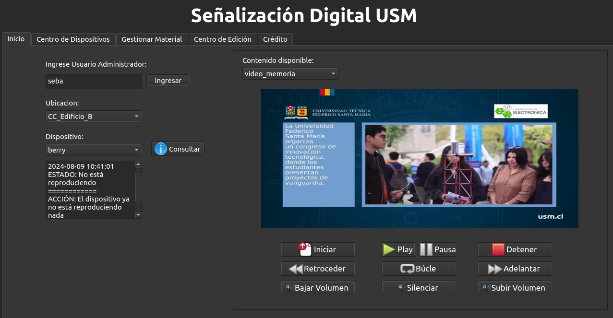

# Digital Signage USM

## Trabajo de Titulacion

Desarrollo de plataforma de senalizacion digital para distribucion de contenido multimedia: Unidad de reproduccion audiovisual.

**Autor:** Sebastian Castillo - Estudiante Ingenieria Civil Electronica UTFSM

## Hardware y Software

### Hardware:

- Raspberry Pi 4
- Notebook

### Software:

- Ubuntu 22.04 LTS
- SSH
- FFmpeg
- MPlayer
